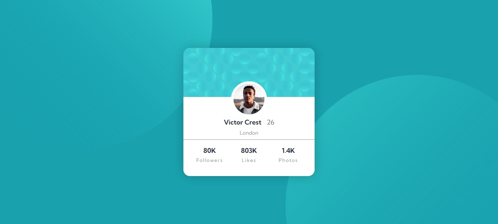

# Frontend Mentor - Profile card component solution

This is a solution to the [Profile card component challenge on Frontend Mentor](https://www.frontendmentor.io/challenges/profile-card-component-cfArpWshJ). Frontend Mentor challenges help you improve your coding skills by building realistic projects. 

## Table of contents

  - [The challenge](#the-challenge)
  - [Screenshot](#screenshot)
  - [Links](#links)
  - [Built with](#built-with)
  - [Author](#author)

## Overview
### The challenge

- Build out the project to the designs provided

### Screenshot

### Links

- Solution URL: [Frontend mentor solution link](https://your-solution-url.com)
- Live Site URL: [Deployed project link](https://simple-profile-component.netlify.app/)

## My process

### Built with

- Semantic HTML5 markup
- CSS custom properties
- Flexbox
- CSS Grid

## Author

- Frontend Mentor - [@Shard-Codes](https://www.frontendmentor.io/profile/Shard-Codes)
